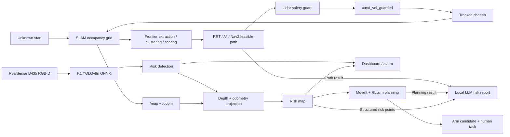

<div align="center">

# K1 Edge AI Risk Inspection Robot

### SLAM-Frontier exploration, YOLO risk detection, risk mapping, MoveIt/RL response planning, and local LLM reporting on SpacemiT K1

[](LICENSE)
[](https://docs.ros.org/en/humble/)
[](https://www.spacemit.com/)
[](https://onnxruntime.ai/)
[](https://bianbu.spacemit.com/)
[](https://github.com/ultralytics/ultralytics)
[](https://github.com/ggml-org/llama.cpp)

[Project Report](docs/report/spacemit_k1_edge_ai_robot_report.docx) |
[Demo Clip](demo/demo_clip_20260708_220330.mp4) |
[Autonomous Mapping Recordings](demo/recordings/) |
[Deployment Notes](docs/k1_yolov8n_onnx_deployment_20260702.md) |
[Risk Vision Model](models/risk_vision/) |
[Submission Index](SUBMISSION.md)

**Language**: [中文](README.md) | English

</div>

## 2026-07-22 Motion-Control and Semantic Mapping Update

The tracked-base firmware now clears incremental-PI state at an explicit hard
stop while keeping the original PI formula and gains. The matching ROS serial
driver sends security-enable frames only during startup, so command-loss
stopping remains active without periodically clearing PI accumulation during a
low-speed action.

The new semantic mapping controller provides direct odometry targets, fresh
odometry gates, zero-command flushing, settled-state checks, drive yaw hold,
LiDAR emergency stopping, and `/cmd_vel_raw` publisher auditing. Routes are
taught at runtime and replayed from exported JSONL events. No newly recorded
competition route, event log, waypoint list, or map coordinate is included in
this update.

```bash
bash tools/start_k1_semantic_mapping_controller.sh mapping-start

# Dry-run and inspect a route captured by the controller.
python3 tools/replay_k1_semantic_events.py route.jsonl

# Execute only after restoring the robot to the taught start pose.
python3 tools/replay_k1_semantic_events.py route.jsonl --execute

bash tools/start_k1_semantic_mapping_controller.sh mapping-stop
```

The reviewed firmware patch and matching HEX are documented in
[`firmware/README.md`](firmware/README.md).

## Overview

This repository is a source-available submission for the SpacemiT K1 MUSE Pi
Pro edge AI application track. The project targets inspection scenarios where
GPS, reliable communication, or cloud inference cannot be assumed. It builds a
mobile robot pipeline that performs mapping, perception, risk localization,
response planning, and report generation locally at the edge.

The current system includes:

- ROS2-based 2D mapping with lidar, odometry, and a scan safety guard.
- Ubuntu ROS2 Humble + Gazebo + RViz simulation for SLAM-Frontier/RRT/Nav2
  autonomous exploration.
- SolidWorks/SW2URDF mechanical arm import package for separated MoveIt and
  leakage-response simulation.
- Intel RealSense D435 RGB-D input and local YOLOv8n ONNX inference on K1.
- Risk detection for `crack`, `corrosion`, `blockage`, and `leakage`.
- Confidence + depth gates for alarm generation and risk point projection.
- `bbox + depth + odom` projection into map-frame risk points.
- Browser dashboard for YOLO overlays, `infer_fps`, `front_min`, odometry,
  alarms, and risk maps.
- SLAM-Frontier exploration and RRT/A*/Nav2 path-generation interfaces.
- MoveIt/RL-style arm response candidates and no-load safety responses.
- Local LLM CLI reports generated from structured risk points.

System loop:

```text
Unknown start -> SLAM builds an occupancy grid from lidar and odometry
SLAM map -> frontier extraction between known free space and unknown space
frontier -> clustering and scoring -> best exploration target
exploration target -> RRT/A*/Nav2 feasible path -> chassis safety guard
chassis execution -> map update -> repeat
D435 RGB-D -> YOLOv8n local inference -> risk event
risk event + depth + odometry -> map risk point
map risk point -> MoveIt+RL planning -> arm response candidate + human task
RRT/A*/Nav2 path + MoveIt/RL result + structured risk points -> local LLM report
```

## Recent Progress

- **2026-07-11**: Completed the Ubuntu Humble autonomous mapping recording
  baseline with Gazebo tracked base, N10P-style lidar, D435-style camera,
  `slam_toolbox`, RRT frontier selection, Nav2, scan safety guard, and RViz
  trajectory visualization.
- **2026-07-08**: Organized the source-available submission repository with
  code, report, model, sample maps, evidence, and demo materials.
- **2026-07-07**: Tuned confidence + depth gates for the real inspection scene.
- **2026-07-06**: Completed the demo pipeline covering SLAM-Frontier
  exploration, D435 YOLO, risk mapping, dashboard, and LLM reporting.
- **2026-07-03**: Completed K1 D435 YOLO deployment and validated the SpaceMIT
  Execution Provider inference path.
- **2026-06-30**: Completed no-load arm response and map-gated action
  interfaces.

## Highlights

### K1 Edge AI Inference

The risk vision model runs locally on K1 through ONNX Runtime with the SpaceMIT
Execution Provider. The demo model is:

```text
models/risk_vision/yolov8n_480x640_q_truncated6_balanced_blockage03.onnx
```

Recorded metrics:

- Risk vision mAP: **0.949**.
- D435 real-time inference on SpaceMIT EP: about **9-11 FPS**.
- Dashboard sample latency: about **108 ms**.
- Risk recognition, risk mapping, and report generation are all performed in
  the local pipeline.

### SLAM-Frontier Autonomous Mapping Simulation

The July 11 Ubuntu simulation baseline demonstrates autonomous exploration:

```text
Gazebo tracked base + N10P lidar + D435-style camera
-> slam_toolbox occupancy grid
-> RRT frontier selection
-> Nav2 path following
-> scan safety guard
-> RViz map / laser / trajectory visualization
```

Related materials:

- Progress note: `docs/autonomous_mapping_progress_20260711.md`
- Simulation package: `sim/tracked_robot_description/`
- Recordings: `demo/recordings/`
- Mechanical arm import audit: `docs/mechanical_arm_1_import_audit_20260711.md`

### Risk Spatialization

The system turns accepted detections into map-frame risk points. Each run can
save overlays, raw frames, risk JSON, dashboard state, map snapshots, and final
reports in one output directory.

Current automatic map-promotion gates used in the real demo:

```text
crack:    confidence >= 0.29, 0.60 m <= depth <= 0.80 m
blockage: confidence >= 0.23, 0.35 m <= depth <= 0.75 m
```

Nearby detections of the same class are merged to avoid repeated risk points
for the same physical object.

### Local LLM Report

The LLM stage is not open-ended chat. It converts structured risk points into a
human-readable action list:

- approximate risk location on the map;
- risk class;
- detection confidence and risk meaning;
- recommended human handling task.

| Label | Meaning | Response |
| --- | --- | --- |
| `crack` | crack / surface damage | clean, seal or repair, re-check |
| `corrosion` | corrosion | remove rust, anti-corrosion treatment, re-check |
| `blockage` | blockage / obstacle | remove obstacle, clear path, re-check |
| `leakage` | leakage | inspect leak, seal, dry, re-check |

## Architecture



## Quick Start

### 1. Prepare the K1 environment

```bash
cd /home/soc/edge-ai-robot-k1
source /opt/ros/humble/setup.bash
source ros2_ws/install/setup.bash
```

### 2. Start guarded SLAM exploration

```bash
ros2 launch turn_on_wheeltec_robot n10p_tank_mapping_safety_guard.launch.py \
  hard_stop_m:=0.10 \
  emergency_stop_m:=0.10 \
  slow_down_m:=0.30 \
  approach_stop_m:=0.20 \
  min_effective_forward:=0.05 \
  clear_max_linear:=0.30 \
  soft_max_linear:=0.10
```

### 3. Start the D435 YOLO risk loop

```bash
sudo env PYTHONUNBUFFERED=1 python3 tools/run_prelim_remote_mapping_yolo_arm_demo.py \
  --provider spacemit \
  --model models/risk_vision/yolov8n_480x640_q_truncated6_balanced_blockage03.onnx \
  --imgsz 640 --conf 0.15 --iou 0.45 --max-det 10 \
  --min-depth-m 0.20 --max-depth-m 1.20 \
  --auto-risk-gates crack:0.29:0.60:0.80,blockage:0.23:0.35:0.75 \
  --dedup-map-grid-m 0.20 \
  --output-dir outputs/prelim_remote_mapping_yolo_arm_demo_v1/live_demo
```

### 4. Open the dashboard

```bash
cd outputs/prelim_remote_mapping_yolo_arm_demo_v1/live_demo
python3 -m http.server 8765 --bind 0.0.0.0
```

Open:

```text
http://<K1_IP>:8765/dashboard.html
http://<K1_IP>:8765/yolo_monitor.html
```

### 5. Finalize a run

```bash
bash tools/finalize_prelim_demo_k1.sh <run_dir>
```

The run directory stores maps, risk frames, risk JSON, dashboard pages, risk
location figures, and the final LLM report.

## Main Entrypoints

| Module | File |
| --- | --- |
| D435 YOLO + risk mapping demo | `tools/run_prelim_remote_mapping_yolo_arm_demo.py` |
| K1 SpaceMIT EP startup script | `tools/start_prelim_noarm_ep_k1.sh` |
| Demo finalization script | `tools/finalize_prelim_demo_k1.sh` |
| Chassis safety guard | `ros2_ws/src/k1_sensor_event_adapter/k1_sensor_event_adapter/scan_safety_guard_node.py` |
| Local LLM report | `tools/run_local_llm_summary.py` |
| Risk map summary | `tools/run_risk_map_summary.py` |
| Arm safety | `src/arm_safety.py` |
| Primitive registry | `configs/primitive_registry.yaml` |
| RL semantic policy | `rl/train_semantic_ppo.py`, `rl/eval_semantic_policy.py` |

## Repository Layout

```text
.
├── ros2_ws/src/              # ROS2 nodes, launch files, safety guard, sensor adapters
├── tools/                    # K1 inference, risk mapping, dashboard, reports, demo scripts
├── src/                      # Risk protocol, arm safety checks, shared logic
├── configs/                  # Risk classes, action semantics, local LLM, arm safety config
├── schemas/                  # JSON schemas for risk points, detections, actions, reports
├── rl/                       # Semantic action space and simulation training/evaluation
├── models/risk_vision/       # Quantized YOLOv8n ONNX sample model and report
├── maps/                     # Remote mapping and risk map samples
├── evidence/                 # End-to-end validation evidence
├── docs/                     # Design docs, report, hardware images, deployment notes
└── demo/                     # Demo video samples and recording notes
```

## Documentation

- [Submission Index](SUBMISSION.md)
- [Source-Available Scope](docs/OPEN_SOURCE_SCOPE.md)
- [Final Project Report](docs/report/spacemit_k1_edge_ai_robot_report.docx)
- [Remote Mapping + YOLO + Arm Demo Design](docs/prelim_remote_mapping_yolo_arm_demo_20260703.md)
- [System Protocol and Logic](docs/k1_full_system_protocol_and_logic_20260630.md)
- [Local LLM Report Interface](docs/local_llm_report_interface_20260701.md)
- [Risk Map Summary Interface](docs/risk_map_summary_interface_20260702.md)
- [Mechanical Arm SW2URDF Import Audit](docs/mechanical_arm_1_import_audit_20260711.md)

## License

This repository is licensed under the
[PolyForm Noncommercial License 1.0.0](LICENSE).

Learning, research, testing, education, and noncommercial demonstration use are
allowed. Commercial use, commercial product integration, commercial deployment,
or commercial sublicensing requires separate written permission.

## Citation

```bibtex
@misc{k1_edge_ai_risk_robot_2026,
  title  = {K1 Edge AI Risk Inspection Robot},
  author = {K1 Edge AI Risk Inspection Robot Contributors},
  year   = {2026},
  note   = {SpaceMIT K1 MUSE Pi Pro edge AI risk inspection system}
}
```
