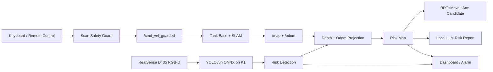

<div align="center">

# K1 Edge AI Risk Inspection Robot

### Remote Mapping, Local YOLO Risk Perception, Risk Mapping, RRT+MoveIt Response, and Local LLM Reporting on SpaceMIT K1

[](LICENSE)


[Project Report](docs/report/spacemit_k1_edge_ai_robot_report.docx) |
[Demo Video](demo/demo_clip_20260708_220330.mp4) |
[Deployment Notes](docs/k1_yolov8n_onnx_deployment_20260702.md) |
[Model Path](models/risk_vision/) |
[Submission Index](SUBMISSION.md)

</div>

## Overview

This repository contains the open-source competition version of a SpaceMIT K1 MUSE Pi Pro edge AI robot system. The robot is designed for GPS-denied and communication-limited inspection scenes, where perception, mapping, risk reasoning, and report generation should run locally on the edge device.

The current system integrates:

- Remote-controlled 2D mapping with ROS2, lidar, odom, and safety-guarded velocity control.
- Intel RealSense D435 RGB-D input and local YOLOv8n ONNX inference on K1.
- Confidence-and-depth gated risk detection for `crack`, `corrosion`, `blockage`, and `leakage`.
- Risk spatialization from `bbox + depth + odom` to map coordinates.
- Browser dashboard for YOLO overlay, `infer_fps`, `front_min`, odom, alarm, and risk map.
- RRT+MoveIt style arm-response planning interface with no-load safety validation.
- Local LLM CLI report generation for final risk disposal recommendations.

The project focuses on a complete edge-side loop:

```text
Remote control -> Safety guard -> SLAM map
D435 RGB-D -> YOLOv8n local inference -> Risk event
Risk event + depth + odom -> Risk map point
Risk map point -> Arm action candidate + human disposal task
Structured risk points -> Local LLM report
```

## News

- **2026-07-08**: Created the GitHub submission repository with code, report, model, sample maps, evidence, and demo material.
- **2026-07-07**: Added field-adjusted risk gates using both confidence and depth.
- **2026-07-06**: Completed preliminary live demo flow: remote mapping, D435 YOLO, risk map, dashboard, and LLM report.
- **2026-07-03**: Completed K1 D435 YOLO deployment path with SpaceMIT Execution Provider.
- **2026-06-30**: Completed arm no-load safety response and map-gated action interface.

## Highlights

### Edge AI on K1

The risk vision model runs locally on K1 through ONNX Runtime with SpaceMIT Execution Provider. The demo model is a quantized YOLOv8n ONNX model:

```text
models/risk_vision/yolov8n_480x640_q_truncated6_balanced_blockage03.onnx
```

Field demo observations:

- Risk vision model mAP: **0.949**.
- D435 live inference with SpaceMIT EP: about **9-11 FPS** in the final demo environment.
- Example dashboard latency: about **108 ms**.
- No cloud API is required for risk detection.

### Guarded Mapping

The base command is not sent directly to the chassis. The safety layer receives `/input_cmd_vel`, reads `/scan`, and publishes `/cmd_vel_guarded`.

Small-map demo safety boundary:

```text
<= 0.10 m: stop
~ 0.20 m: slow approach
>= 0.30 m: clear speed limit
```

Core node:

```text
ros2_ws/src/k1_sensor_event_adapter/k1_sensor_event_adapter/scan_safety_guard_node.py
```

### Risk Spatialization

Each accepted detection is converted into a map-level risk point. The system saves evidence frames, risk JSON, risk map images, dashboard status, and final report under the same run directory.

Accepted field gates:

```text
crack:    confidence >= 0.29, 0.60 m <= depth <= 0.80 m
blockage: confidence >= 0.23, 0.35 m <= depth <= 0.75 m
```

Neighbor merging is used so repeated frames do not create duplicated risks for the same physical target.

### Local Report Generation

The LLM report is generated from structured risk points rather than free-form chat. The final report tells the human operator:

- where the risk is located,
- what category it belongs to,
- how confident the detection is,
- what manual disposal action is recommended.

Example disposal mapping:

| Label | Meaning | Disposal action |
| --- | --- | --- |
| `crack` | breakage / wall crack | surface cleaning, repair, sealing, recheck |
| `corrosion` | rust / corrosion | rust removal, anti-corrosion treatment, wall recheck |
| `blockage` | obstacle / blockage | remove obstacle, clean passage, recheck clearance |
| `leakage` | leakage / seepage | locate leak, seal, dry, recheck |

## System Pipeline



## Repository Features

- **ROS2 bring-up and mapping**: tank base, lidar, odom, SLAM, map saving.
- **Safety-guarded control**: front-distance gating for teleop and demo motion.
- **D435 local perception**: live RGB-D capture, overlay visualization, depth-aware risk gating.
- **Risk event archive**: overlay frames, raw RGB frames, detection JSON, runtime metrics.
- **Risk map rendering**: projected risk points with category-level merging.
- **Dashboard UI**: browser-based K1/Windows visualization through local HTTP server.
- **Arm response interface**: no-load safety validation and action-space mapping.
- **Local report generation**: CLI-based LLM reporting with token-rate recording.
- **RL/RRT-ready planning assets**: semantic action space, primitive registry, training/evaluation scripts.

## Quick Start

### 1. Prepare K1 Environment

```bash
cd /home/soc/edge-ai-robot-k1
source /opt/ros/humble/setup.bash
source ros2_ws/install/setup.bash
```

### 2. Start Guarded Mapping

```bash
ros2 launch turn_on_wheeltec_robot n10p_tank_mapping_safety_guard.launch.py \
  hard_stop_m:=0.10 \
  emergency_stop_m:=0.10 \
  slow_down_m:=0.30 \
  approach_stop_m:=0.20 \
  min_effective_forward:=0.05 \
  clear_max_linear:=0.30 \
  soft_max_linear:=0.10
```

### 3. Run D435 YOLO Risk Loop

```bash
sudo env PYTHONUNBUFFERED=1 python3 tools/run_prelim_remote_mapping_yolo_arm_demo.py \
  --provider spacemit \
  --model models/risk_vision/yolov8n_480x640_q_truncated6_balanced_blockage03.onnx \
  --imgsz 640 --conf 0.15 --iou 0.45 --max-det 10 \
  --min-depth-m 0.20 --max-depth-m 1.20 \
  --auto-risk-gates crack:0.29:0.60:0.80,blockage:0.23:0.35:0.75 \
  --dedup-map-grid-m 0.20 \
  --output-dir outputs/prelim_remote_mapping_yolo_arm_demo_v1/live_demo
```

### 4. Open Dashboard

```bash
cd outputs/prelim_remote_mapping_yolo_arm_demo_v1/live_demo
python3 -m http.server 8765 --bind 0.0.0.0
```

Open:

```text
http://<K1_IP>:8765/dashboard.html
http://<K1_IP>:8765/yolo_monitor.html
```

### 5. Finalize Run

```bash
bash tools/finalize_prelim_demo_k1.sh <run_dir>
```

The run directory should contain map files, risk frames, risk JSON, dashboard artifacts, risk map images, and the final LLM report.

## Main Entry Points

| Area | File |
| --- | --- |
| Integrated D435 YOLO + risk map demo | `tools/run_prelim_remote_mapping_yolo_arm_demo.py` |
| K1 SpaceMIT EP launcher | `tools/start_prelim_noarm_ep_k1.sh` |
| Demo finalization | `tools/finalize_prelim_demo_k1.sh` |
| Safety guarded control | `ros2_ws/src/k1_sensor_event_adapter/k1_sensor_event_adapter/scan_safety_guard_node.py` |
| Local LLM report | `tools/run_local_llm_summary.py` |
| Risk map summary | `tools/run_risk_map_summary.py` |
| Arm safety | `src/arm_safety.py` |
| Primitive registry | `configs/primitive_registry.yaml` |
| RL semantic policy | `rl/train_semantic_ppo.py`, `rl/eval_semantic_policy.py` |

## Model and Data

This open-source repository includes a lightweight deployable model artifact for reproduction:

```text
models/risk_vision/yolov8n_480x640_q_truncated6_balanced_blockage03.onnx
```

Large raw datasets, long videos, ROS bags, and temporary output directories are intentionally excluded. The dataset and model completion path is documented here:

- [Risk vision model completion path](docs/risk_vision_model_completion_path_20260707.md)
- [K1 YOLOv8n ONNX deployment](docs/k1_yolov8n_onnx_deployment_20260702.md)
- [XQuant YOLOv8 quantization](docs/k1_xquant_yolov8_truncated_quantization_20260702.md)

## Project Structure

```text
.
├── ros2_ws/src/              # ROS2 packages, launch files, safety guard, sensor adapters
├── tools/                    # K1 demo scripts, YOLO, risk map, dashboard, reports
├── src/                      # Shared protocol and arm safety code
├── configs/                  # Risk classes, action semantics, LLM and arm configs
├── schemas/                  # Risk/detection/action/report JSON schemas
├── rl/                       # Semantic policy training and evaluation scripts
├── models/risk_vision/       # Quantized YOLOv8n ONNX demo model and reports
├── maps/                     # Saved mapping and risk-map examples
├── evidence/                 # End-to-end evidence snapshots
├── docs/                     # Design docs, project report, hardware images
└── demo/                     # Demo video sample or final video link
```

## Documentation

- [Submission index](SUBMISSION.md)
- [Open-source scope](docs/OPEN_SOURCE_SCOPE.md)
- [Final project report](docs/report/spacemit_k1_edge_ai_robot_report.docx)
- [Remote mapping + YOLO + arm demo design](docs/prelim_remote_mapping_yolo_arm_demo_20260703.md)
- [Full system protocol and logic](docs/k1_full_system_protocol_and_logic_20260630.md)
- [Local LLM report interface](docs/local_llm_report_interface_20260701.md)
- [Risk map summary interface](docs/risk_map_summary_interface_20260702.md)

## License

This repository is released under the [MIT License](LICENSE).

## Citation

If this project is useful for your edge AI robotics work, please cite this repository:

```bibtex
@misc{k1_edge_ai_risk_robot_2026,
  title  = {K1 Edge AI Risk Inspection Robot},
  author = {K1 Edge AI Risk Inspection Robot Contributors},
  year   = {2026},
  note   = {SpaceMIT K1 MUSE Pi Pro edge AI risk inspection system}
}
```
