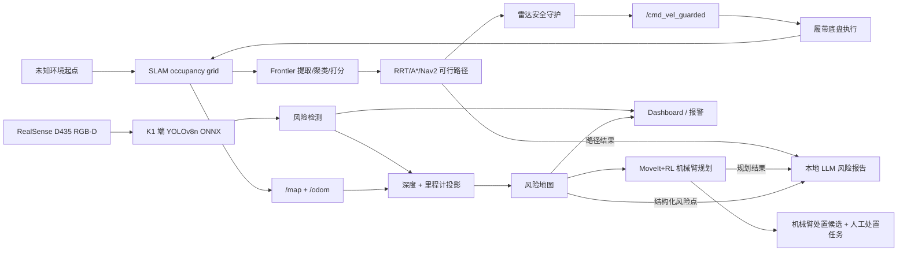

<div align="center">

# K1 边缘 AI 风险探测机器人

### 基于进迭时空 K1 的 SLAM-Frontier 自主探测、YOLO 风险识别、风险落图、MoveIt+RL 响应与本地 LLM 报告

[](LICENSE)
[](https://docs.ros.org/en/humble/)
[](https://www.spacemit.com/)
[](https://onnxruntime.ai/)
[](https://bianbu.spacemit.com/)
[](https://github.com/ultralytics/ultralytics)
[](https://github.com/ggml-org/llama.cpp)

[项目报告 PDF](docs/report/基于K1MusePiPro的复杂受限空间离线认知边缘智能终端.pdf) |
[项目报告 DOCX](docs/report/spacemit_k1_edge_ai_robot_report.docx) |
[演示视频](demo/基于K1MusePiPro的复杂受限空间离线认知边缘智能终端.mp4) |
[自主建图录屏](demo/recordings/) |
[部署说明](docs/k1_yolov8n_onnx_deployment_20260702.md) |
[模型目录](models/risk_vision/) |
[提交材料索引](SUBMISSION.md)

**语言 / Language**：中文 | [English](README.en.md)

</div>

## 项目简介

本仓库为进迭时空 K1 MUSE Pi Pro 边缘 AI 应用赛道的公开源码提交版。项目面向 GPS 拒止、通信受限、云端不可依赖的巡检场景，构建一套在端侧完成建图、感知、风险定位、处置规划和报告生成的移动机器人系统。

当前系统已经集成：

- 基于 ROS2、雷达、里程计和安全守护的遥控二维建图。
- Ubuntu ROS2 Humble + Gazebo + RViz 下的 SLAM-Frontier/RRT/Nav2 自主建图仿真。
- SolidWorks/SW2URDF 机械臂导入包，作为后续 MoveIt 与 leakage 处置仿真的独立模型。
- Intel RealSense D435 RGB-D 输入和 K1 本地 YOLOv8n ONNX 推理。
- 面向 `crack`、`corrosion`、`blockage`、`leakage` 的风险识别。
- 结合 confidence 与 depth 的自动报警和落图门限。
- 将 `bbox + depth + odom` 转换为地图坐标风险点。
- 浏览器 dashboard 展示 YOLO overlay、`infer_fps`、`front_min`、odom、报警和风险地图。
- SLAM-Frontier 自主探测与 RRT/A*/Nav2 路径生成接口。
- MoveIt 机械臂仿真配置、`link4_tip_link` 末端 TCP 标定与地面任务到达验证。
- MoveIt+RL 风格的机械臂处置动作候选与 no-load 安全响应。
- 本地 LLM CLI 根据结构化风险点生成最终风险报告。

系统闭环如下：

```text
未知环境起点 -> SLAM 根据雷达/里程计增量生成 occupancy grid
SLAM map -> 提取 frontier：已知空闲区 与 未知区 的边界
frontier -> 聚类并打分 -> 选择最优探索目标
探索目标 -> RRT/A*/Nav2 生成可行路径 -> 底盘安全守护执行
底盘执行 -> 地图更新后重复
D435 RGB-D -> YOLOv8n 本地推理 -> 风险事件
风险事件 + 深度 + 里程计 -> 地图风险点
地图风险点 -> MoveIt+RL 规划 -> 机械臂处置候选 + 人工处置任务
RRT/A*/Nav2 路径结果 + MoveIt+RL 规划结果 + 结构化风险点 -> 本地 LLM 风险报告
```

## 2026-07-17 实机 RRT/Nav2 探图更新

在 K1 实机 2m x 2m 复赛复刻场景中，已补充 SLAM + Nav2 + RRT frontier 自动探图启动流程。当前建议先用纯 RRT/Nav2 验证建图和底盘运动稳定性，再单独接入 D435 YOLO 风险识别，避免 EP/CPU 负载影响导航生命周期。

实机链路：

```text
N10P lidar + Tank odom
-> slam_toolbox occupancy grid
-> frontier extraction
-> RRT goal sampling with obstacle / map-edge clearance
-> Nav2 NavigateToPose
-> /cmd_vel_raw
-> scan_safety_guard_node
-> /cmd_vel_guarded
-> Tank base
```

Windows 端一键启动纯 RRT 2m 长运行：

```powershell
Set-Location K:\risc-vCar\edge-ai-robot-k1
powershell -ExecutionPolicy Bypass -File tools\win_start_real_k1_rrt_nav2_mapping.ps1 `
  -Mode nav2-run-2m-unlimited `
  -CleanFirst
```

K1 端分步启动：

```bash
cd /home/soc/edge-ai-robot-k1
bash tools/start_real_k1_rrt_nav2_mapping.sh clean
bash tools/start_real_k1_rrt_nav2_mapping.sh nav2-slam
# wait until nav2_slam_guard.log contains: Managed nodes are active
bash tools/start_real_k1_rrt_nav2_mapping.sh rrt-run-2m-unlimited
```

侧边擦碰修正：现场发现过 RRT 目标贴近地图框架导致履带车侧边擦碰。原因不是 Nav2 完全按质点规划，而是现场临时 RRT 参数曾放得过松，例如 `--inflation-m 0.02`、`--map-edge-margin-m 0.00`。2026-07-18 实机把场地扩大到约 `2.5m x 2.5m` 后，当前使用更大胆但带侧向守护的参数：

```text
RRT_INFLATION_M=0.12
RRT_FRONTIER_STANDOFF_M=0.10
RRT_GOAL_SEPARATION_M=0.12
RRT_MAP_EDGE_MARGIN_M=0.15
FRONT_COLLISION_MIN_X_M=0.12
MICRO_ADJUST_SECTOR_DEG=45.0
MICRO_ADJUST_TRIGGER_M=0.28
MICRO_ADJUST_CLEAR_M=0.34
ESCAPE_REVERSE_TRIGGER_M=0.16
Nav2 footprint ~= 0.50 m x 0.44 m outer envelope
```

最终实机 run 目录为 `/home/soc/edge-ai-robot-k1/outputs/real_k1_rrt_nav2_mapping_20260718_024536`，地图保存为 `maps/map_after_rrt_free_roam_stop_20260718_030446.yaml`。后期 RRT 进入大量 `wfd_free_roam` 后多次 `progress_timeout/status_6`，因此主动停止并保存地图；下一步应收紧 late-stage free-roam，避免低 clearance 边界目标空转。

## 2026-07-19 实机完整链路更新

在 2m 复赛复刻场景中，当前实机链路已进入“自由探图 + YOLO 风险识别 + blockage 靠近 + 近距离确认预留”的完整演示形态。YOLO 使用 SpaceMIT Execution Provider，默认 `1s/frame`，不开视频流，避免 UI 和 DDS 负载干扰 Nav2。

当前 2m 默认 RRT 档位：

```text
RRT_SAMPLE_RADIUS_M=0.50
RRT_MIN_GOAL_DISTANCE_M=0.30
RRT_INFLATION_M=0.12
RRT_FRONTIER_STANDOFF_M=0.10
RRT_MIN_GOAL_CLEARANCE_M=0.24
RRT_MAP_EDGE_MARGIN_M=0.10
RRT_FREE_ROAM_MIN_DISTANCE_M=0.15
RRT_REPLAN_SLEEP_S=2.5
```

风险识别采用“候选记录”和“正式落图”分离：

```text
APPROACH_RISK_GATES: conf >= 0.15, depth 0.20-1.20m
AUTO_RISK_GATES:     conf >= 0.60, depth 0.20-1.20m
RISK_MAP_WRITE_POLICY=approach_confirmed
```

`crack`、`corrosion`、`leakage` 先作为候选记录，RRT 不被打断；车辆自然靠近后再做近距离确认。`blockage` 可触发事件驱动靠近，并预留机械臂处置语义。风险事件现在会尝试通过 TF 写入 `map_point_xy_m`；如果只有 `odom_point_xy_m`，可视化会标为 `odom≈` 近似候选，不再当作精确地图点。

新增自适应可视化工具：

```bash
python3 tools/visualize_k1_map_rrt_risk_overlay.py \
  --map-yaml <run>/maps/<map>.yaml \
  --rrt-log <run>/rrt_unlimited.log \
  --risk-events <run>/yolo_risk/risk_events.jsonl \
  --approach-records <run>/risk_approach/risk_approach_records.jsonl \
  --output-dir <local_visualization_dir>
```

该工具会根据 SLAM 地图墙线自动估计主方向，把地图旋成横平竖直，并叠加 RRT goal、YOLO 风险候选和 approach 记录。2026-07-19 一轮数据中，YOLO 记录 26 个风险候选，过滤 `confidence >= 0.50` 后剩 7 个高置信候选；该轮旧日志尚无 `map_point_xy_m`，因此这些点只能作为 `odom≈` 诊断点。

当前隧道 / 窄通道问题主要来自规则层保守叠加：RRT 目标 clearance、Nav2 footprint/inflation 和 safety guard 的 corridor stuck/spin escape 同时限制了进入窄通道的意愿。下一步建议加入明确的 `corridor_mode`：左右近但前方仍有连续空间时，低速居中前进；只有前方稳定堵住且 odom 无进展时，才触发 180 度掉头。

### K1 实机进程控制

完整链路建议按“清理残留 -> 启动 SLAM/Nav2 -> 启动 YOLO/approach -> 启动 RRT”的顺序执行。所有命令均在 K1 端运行：

```bash
ssh soc@192.168.43.40
cd /home/soc/edge-ai-robot-k1

# 1. 清理旧 SLAM/Nav2/RRT/YOLO/D435/guard 进程
bash tools/start_real_k1_rrt_nav2_mapping.sh clean

# 2. 启动 SLAM + Nav2 + safety guard
bash tools/start_real_k1_rrt_nav2_mapping.sh nav2-slam
```

另开窗口确认 Nav2 active 后，再启动风险识别和靠近链路：

```bash
cd /home/soc/edge-ai-robot-k1
RUN=$(cat .current_real_k1_rrt_nav2_run_dir)

# 启动 D435 + SpaceMIT EP YOLO + risk approach 状态机
bash tools/start_real_k1_rrt_nav2_mapping.sh risk-approach "$RUN"

# 启动无限 RRT/Nav2 自由探图
bash tools/start_real_k1_rrt_nav2_mapping.sh rrt-run-2m-unlimited "$RUN"
```

常用监视命令：

```bash
cd /home/soc/edge-ai-robot-k1
RUN=$(cat .current_real_k1_rrt_nav2_run_dir)

tail -f "$RUN/rrt_unlimited.log"
tail -f "$RUN/yolo_risk_headless.log"
tail -f "$RUN/risk_approach.log"
tail -f "$RUN/risk_approach/risk_approach_records.jsonl"
watch -n 0.5 "cat $RUN/yolo_risk/alarm_state.json"

ps -eo pid,pcpu,pmem,args | grep -E 'slam_toolbox|nav2_|sim_rrt|run_prelim|risk_approach|realsense|scan_safety' | grep -v grep
```

停止、零速和保存地图：

```bash
cd /home/soc/edge-ai-robot-k1
RUN=$(cat .current_real_k1_rrt_nav2_run_dir)

# 只停 RRT，保留 SLAM/Nav2/YOLO
pkill -INT -f 'sim_rrt_frontier_explorer.py' || true

# 全链路零速
bash tools/start_real_k1_rrt_nav2_mapping.sh zero

# 保存当前 /map
bash tools/start_real_k1_rrt_nav2_mapping.sh save-map "$RUN"

# 完整收车
bash tools/start_real_k1_rrt_nav2_mapping.sh clean
```

如果 `map_saver_cli` 出现 FastDDS SHM port lock，可以临时使用 UDPv4 保存地图：

```bash
cd /home/soc/edge-ai-robot-k1
source /opt/ros/humble/setup.bash
source ros2_ws/install/setup.bash
RUN=$(cat .current_real_k1_rrt_nav2_run_dir)
mkdir -p "$RUN/maps"
FASTDDS_BUILTIN_TRANSPORTS=UDPv4 ros2 run nav2_map_server map_saver_cli \
  -f "$RUN/maps/map_$(date +%Y%m%d_%H%M%S)"
```

## 更新记录

- **2026-07-19**：打通 K1 实机自由探图、SpaceMIT EP YOLO 风险候选记录、blockage 靠近和近距离确认预留；修正风险点坐标系，区分 `map_point_xy_m` 与 `odom≈` 候选；新增自适应横平竖直地图 + RRT + 风险点可视化工具。
- **2026-07-18**：完成 K1 实机约 2.5m 场地纯 RRT/Nav2/SLAM 建图验证；加入 45 度侧向微调、贴边短后退和更稳的薄壁角落处理，保存最终地图 `map_after_rrt_free_roam_stop_20260718_030446.yaml`。
- **2026-07-17**：补充 K1 实机 2m 场地 RRT/Nav2 自动探图脚本、Windows 启动入口、保守 footprint/边界参数，并记录侧向擦碰的工程原因与修正方式。
- **2026-07-12**：完成机械臂 MoveIt 地面任务 TCP 到达验证；以 `link4_tip_link` 作为第四截末端 TCP，1000 个保守地面工作区目标全部规划并到达，最大 TCP 误差约 7.18 mm，平均约 2.52 mm。记录见 `docs/mechanical_arm_moveit_tcp_reach_20260712.md`，本地输出位于 `outputs/moveit_arm_visual_ground_tcp_direct_marker_1000/`。
- **2026-07-11**：完成 Ubuntu Humble 仿真自主建图录屏基线：Gazebo 履带底盘、N10P 雷达、D435、`slam_toolbox`、RRT frontier、Nav2、安全守护和 RViz 轨迹显示。
- **2026-07-08**：整理 GitHub 公开源码提交仓库，补充代码、报告、模型、样例地图、evidence 和演示材料。
- **2026-07-07**：根据实机场景完成 confidence + depth 联合门限调整。
- **2026-07-06**：完成演示链路：SLAM-Frontier 自主探测、D435 YOLO、风险地图、dashboard 和 LLM 报告。
- **2026-07-03**：完成 K1 D435 YOLO 部署流程，并验证 SpaceMIT Execution Provider 推理路径。
- **2026-06-30**：完成机械臂 no-load 安全响应和地图门控动作接口。

## 核心亮点

### K1 端侧 AI 推理

风险视觉模型在 K1 本地运行，通过 ONNX Runtime 的 SpaceMIT Execution Provider 执行量化 YOLOv8n 模型，不依赖云端 API。演示模型位于：

```text
models/risk_vision/yolov8n_480x640_q_truncated6_balanced_blockage03.onnx
```

### SLAM-Frontier 自主建图仿真

7 月 11 日完成的 Ubuntu 仿真链路用于展示自主探图能力：

```text
Gazebo tracked base + N10P lidar + D435-style camera
-> slam_toolbox occupancy grid
-> RRT frontier selection
-> Nav2 path following
-> scan safety guard
-> RViz map / laser / trajectory visualization
```

对应材料：

- 进度记录：`docs/autonomous_mapping_progress_20260711.md`
- 仿真包：`sim/tracked_robot_description/`
- 录屏：`demo/recordings/`
- 机械臂导入审计：`docs/mechanical_arm_1_import_audit_20260711.md`

现场记录指标：

- 风险视觉模型 mAP：**0.949**。
- D435 实时推理在 SpaceMIT EP 下约 **9-11 FPS**。
- dashboard 示例延迟约 **108 ms**。
- 风险识别、风险落图和报告生成均在本地链路中完成。

### 风险空间化

系统将通过门限的检测框转换为地图风险点，并将风险帧、风险 JSON、风险地图、dashboard 状态和最终报告保存在同一个 run 目录中，方便回放和复核。

实机场景中采用的自动落图门限：

```text
crack：    confidence >= 0.29，0.60 m <= depth <= 0.80 m
blockage： confidence >= 0.23，0.35 m <= depth <= 0.75 m
```

同类近邻合并用于避免连续帧重复保存同一物理风险点。

### 本地 LLM 报告

LLM 报告不是开放式聊天，而是从结构化风险点生成处置清单。最终报告面向人工巡检人员回答：

- 风险位于地图的哪个近似位置；
- 风险属于哪一类；
- 检测置信度和风险含义是什么；
- 人工需要执行什么处置动作。

风险处置映射示例：

| 标签 | 中文含义 | 处置动作 |
| --- | --- | --- |
| `crack` | 破损 / 裂缝 | 表面清理、裂缝修补、密封、复查 |
| `corrosion` | 锈蚀 / 腐蚀 | 除锈、防腐处理、管壁复查 |
| `blockage` | 障碍物 / 堵塞 | 移除障碍物、清理通道、复查通行 |
| `leakage` | 渗漏 / 漏液 | 查漏、封堵、干燥、复查 |

## 系统流程



## 仓库特性

- **ROS2 建图与启动**：履带底盘、雷达、里程计、SLAM 和地图保存。
- **安全守护控制**：基于前向距离的遥控速度过滤与急停/慢速/放行逻辑。
- **D435 本地感知**：RGB-D 采集、YOLO overlay、深度门限和风险事件保存。
- **风险事件归档**：保存 overlay 帧、原始 RGB 帧、检测 JSON 和运行指标。
- **风险地图渲染**：风险点投影到地图坐标，并支持同类近邻合并。
- **Dashboard UI**：通过 K1 本地 HTTP 服务在 K1 屏幕或 Windows 浏览器查看。
- **机械臂响应接口**：no-load 安全验证、动作空间映射和处置候选。
- **本地报告生成**：CLI 形式展示 LLM token 流式输出和最终处置清单。
- **SLAM-Frontier/RRT/A*/Nav2 与 RL 扩展接口**：保留探索目标、路径生成、语义动作空间、primitive registry、训练和评估脚本。

## 快速开始

### 1. 准备 K1 环境

```bash
cd /home/soc/edge-ai-robot-k1
source /opt/ros/humble/setup.bash
source ros2_ws/install/setup.bash
```

### 2. 启动 SLAM-Frontier 自主探测与安全守护

```bash
ros2 launch turn_on_wheeltec_robot n10p_tank_mapping_safety_guard.launch.py \
  hard_stop_m:=0.10 \
  emergency_stop_m:=0.10 \
  slow_down_m:=0.30 \
  approach_stop_m:=0.20 \
  min_effective_forward:=0.05 \
  clear_max_linear:=0.30 \
  soft_max_linear:=0.10
```

### 3. 启动 D435 YOLO 风险闭环

```bash
sudo env PYTHONUNBUFFERED=1 python3 tools/run_prelim_remote_mapping_yolo_arm_demo.py \
  --provider spacemit \
  --model models/risk_vision/yolov8n_480x640_q_truncated6_balanced_blockage03.onnx \
  --imgsz 640 --conf 0.15 --iou 0.45 --max-det 10 \
  --min-depth-m 0.20 --max-depth-m 1.20 \
  --auto-risk-gates crack:0.29:0.60:0.80,blockage:0.23:0.35:0.75 \
  --dedup-map-grid-m 0.20 \
  --output-dir outputs/prelim_remote_mapping_yolo_arm_demo_v1/live_demo
```

### 4. 打开 dashboard

```bash
cd outputs/prelim_remote_mapping_yolo_arm_demo_v1/live_demo
python3 -m http.server 8765 --bind 0.0.0.0
```

浏览器访问：

```text
http://<K1_IP>:8765/dashboard.html
http://<K1_IP>:8765/yolo_monitor.html
```

### 5. 结束并整理结果

```bash
bash tools/finalize_prelim_demo_k1.sh <run_dir>
```

运行目录中会保存地图文件、风险帧、风险 JSON、dashboard 页面、风险位置图和最终 LLM 报告。

## 主要代码入口

| 模块 | 文件 |
| --- | --- |
| D435 YOLO + 风险地图集成演示 | `tools/run_prelim_remote_mapping_yolo_arm_demo.py` |
| K1 SpaceMIT EP 启动脚本 | `tools/start_prelim_noarm_ep_k1.sh` |
| 演示收尾脚本 | `tools/finalize_prelim_demo_k1.sh` |
| 底盘安全守护 | `ros2_ws/src/k1_sensor_event_adapter/k1_sensor_event_adapter/scan_safety_guard_node.py` |
| 本地 LLM 报告 | `tools/run_local_llm_summary.py` |
| 风险地图总结 | `tools/run_risk_map_summary.py` |
| 机械臂安全 | `src/arm_safety.py` |
| 动作原语配置 | `configs/primitive_registry.yaml` |
| RL 语义策略 | `rl/train_semantic_ppo.py`、`rl/eval_semantic_policy.py` |

## 模型与数据

仓库包含一个可用于复现实机演示的轻量化模型文件：

```text
models/risk_vision/yolov8n_480x640_q_truncated6_balanced_blockage03.onnx
```

大规模原始数据集、ROS bag 和临时运行输出未纳入仓库；最终演示视频已放入 `demo/`，项目报告同时提供 DOCX 与 PDF 版本。数据采集、模型训练、量化和阈值调整过程见：

- [风险视觉模型完成路径](docs/risk_vision_model_completion_path_20260707.md)
- [K1 YOLOv8n ONNX 部署说明](docs/k1_yolov8n_onnx_deployment_20260702.md)
- [XQuant YOLOv8 量化说明](docs/k1_xquant_yolov8_truncated_quantization_20260702.md)

## 项目结构

```text
.
├── ros2_ws/src/              # ROS2 节点、launch、底盘安全守护、传感器适配
├── tools/                    # K1 推理、风险落图、dashboard、报告生成、演示脚本
├── src/                      # 风险协议、机械臂安全校验等通用代码
├── configs/                  # 风险类别、动作语义、本地 LLM、机械臂安全配置
├── schemas/                  # 风险点、检测结果、动作候选、报告 JSON schema
├── rl/                       # 语义动作空间与仿真训练/评估脚本
├── models/risk_vision/       # 已量化 YOLOv8n ONNX 示例模型与量化报告
├── maps/                     # 遥控建图与风险地图样例
├── evidence/                 # 端到端验证记录样例
├── docs/                     # 设计文档、项目报告、硬件图片、部署记录
└── demo/                     # 演示视频样例或最终视频链接说明
```

## 文档索引

- [提交材料索引](SUBMISSION.md)
- [开源范围说明](docs/OPEN_SOURCE_SCOPE.md)
- [最终项目报告 PDF](docs/report/基于K1MusePiPro的复杂受限空间离线认知边缘智能终端.pdf)
- [最终项目报告 DOCX](docs/report/spacemit_k1_edge_ai_robot_report.docx)
- [最终演示视频](demo/基于K1MusePiPro的复杂受限空间离线认知边缘智能终端.mp4)
- [遥控建图 + YOLO + 机械臂演示设计](docs/prelim_remote_mapping_yolo_arm_demo_20260703.md)
- [系统协议与整体逻辑](docs/k1_full_system_protocol_and_logic_20260630.md)
- [本地 LLM 报告接口](docs/local_llm_report_interface_20260701.md)
- [风险地图总结接口](docs/risk_map_summary_interface_20260702.md)
- [机械臂 SW2URDF 导入审计](docs/mechanical_arm_1_import_audit_20260711.md)

## 写在最后

从一块国产 RISC-V 开发板出发，我们完成了感知、推理、规划和执行的闭环，也亲身经历了国产平台从“能够运行”走向“稳定运行”所需要跨越的工程门槛。驱动适配、模型算子转换、EP 后端稳定性、传感器时序和进程启动顺序，这些看似琐碎的调试工作，最终共同构成了一个真正能够运行起来的端侧智能机器人样机。

今天的 K1 还不是终点，当前系统也仍然只是一次小规模尝试。但当一块国产芯片真正驱动机器人看见环境、理解风险并作出回应时，我们看到的不只是一个作品的完成，更看到了一条仍在延伸的道路。我们期待国产 RISC-V 继续突破算力、软件和生态边界，也愿意成为这段成长过程中的使用者、记录者和参与者。

## 开源协议

本仓库采用 [PolyForm Noncommercial License 1.0.0](LICENSE) 授权。
允许学习、研究、测试、教育和非商用展示使用；未经额外书面授权，
不得用于商业用途、商业产品集成、商业部署或商业转授权。

## 引用

如果本项目对你的边缘 AI 机器人项目有帮助，可按如下形式引用：

```bibtex
@misc{k1_edge_ai_risk_robot_2026,
  title  = {K1 Edge AI Risk Inspection Robot},
  author = {K1 Edge AI Risk Inspection Robot Contributors},
  year   = {2026},
  note   = {SpaceMIT K1 MUSE Pi Pro edge AI risk inspection system}
}
```
