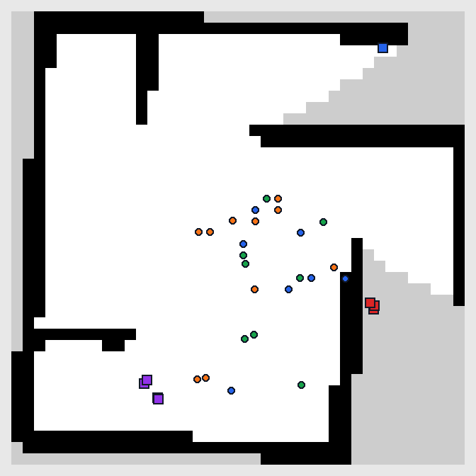
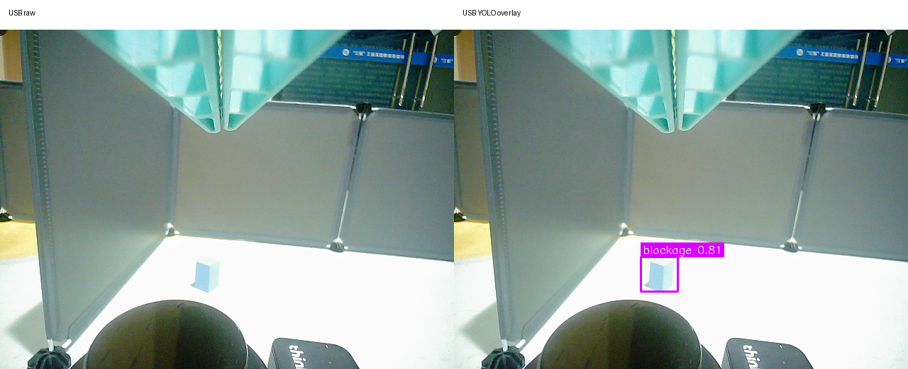

# K1 实机完整链验证结果（2026-07-20）

本结果包记录一次真实行驶的 `SLAM + Nav2 + RRT + SpaceMIT EP YOLO + blockage approach + USB close confirm` 完整链测试。场地地图为 `40 x 40` 栅格、`0.05m/pixel`，对应约 `2m x 2m`。

## 运行结论

- 完整链连续资源采样 180 秒，共 90 个样本。
- RRT 在本轮完整运行中发送 27 个目标；已记录的 25 个结果中，`status_4=8`、`progress_timeout=11`、`physical_stuck=6`。
- D435 YOLO 记录 6 个风险事件：3 个 corrosion、2 个 blockage、1 个 crack。
- blockage 正式事件触发一次 RRT 中断，USB 近距离图像确认得到 `blockage=0.8061`，随后完成机械臂语义切换模拟并恢复 RRT。
- 最终地图、RRT 目标、全部 YOLO 点和 approach 记录已生成自适应横平竖直叠图；自动校正角为 `-0.5deg`。

## 资源统计

以下均为 180 秒窗口内的均值。Linux 单进程 CPU 以单核 `100%` 计，K1 八核总上限约为 `800%`。

| 指标 | 均值 | P95 / 备注 |
|---|---:|---:|
| 系统 CPU | 78.68% | P95 87.04% |
| 已跟踪进程 CPU 合计 | 527.31% | P95 591.42% |
| 可用内存 | 14684.65 MiB | 内存不是瓶颈 |
| YOLO + D435 | 135.37% | SpaceMIT EP，1 秒一帧 |
| RRT | 68.03% | 包含活动规划与 ROS 回调 |
| safety guard | 44.21% | 实时 `/scan` 防撞与走廊逻辑 |
| chassis | 31.39% | 底盘驱动 |
| SLAM Toolbox | 11.71% | P50 8.50% |
| risk approach | 20.34% | 包含事件处置等待阶段 |

完整数据见 [`full_chain_resources.summary.json`](full_chain_resources.summary.json)。

## 已知问题

1. 同一个 blockage 目前可能同时保留空间融合候选和 USB 核验后的 confirmed 记录；两者还存在 `map`/`odom` 坐标契约差异，需要在后续版本统一 risk identity 后再跨阶段去重。
2. RRT 仍有较多 `progress_timeout` 和角向 physical-stuck，Nav2 controller 在高负载时偶发控制周期超时。
3. USB 核验子进程未加载 SpaceMIT EP，当前回退 CPU，单帧约 4.5 秒；主 D435 YOLO 仍使用 SpaceMIT EP。
4. `status_4` 是 Nav2 action 成功状态；其余结果需要结合真实里程计和控制输出继续优化。

## 结果文件

- [`full_map_rrt_yolo_usb_static.png`](full_map_rrt_yolo_usb_static.png)：SLAM、RRT、YOLO 和 approach 静态总览。
- [`full_map_rrt_yolo_usb.html`](full_map_rrt_yolo_usb.html)：可交互坐标查看器。
- [`full_map_rrt_yolo_usb.json`](full_map_rrt_yolo_usb.json)：27 个 RRT goal 和风险点的结构化数据。
- [`usb_close_confirm_raw_overlay.png`](usb_close_confirm_raw_overlay.png)：USB 原图与 YOLO 核验框对比。
- [`risk_events.jsonl`](risk_events.jsonl)：全部 D435 风险事件。
- [`confirmed_risk_map_points.json`](confirmed_risk_map_points.json)：USB 近距离确认结果。
- [`map_final_20260720_012438.yaml`](map_final_20260720_012438.yaml)：最终 SLAM 地图元数据。

